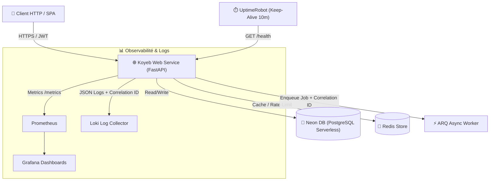

# 🚀 Projet Fil Rouge : API de Gestion de Tâches (Task Manager API)

**Statut** : 🟡 En Développement Actif  
**Dépôt GitHub API** : [github.com/votre-username/task-manager-api](https://github.com/votre-username/task-manager-api)  
**Démo Live (Koyeb)** : [task-api-demo.koyeb.app/docs](https://task-api-demo.koyeb.app/docs)  
**Base PostgreSQL** : Neon DB Serverless (Pérenne 0 €)  
**Couverture de Code** : 

---

## 1. Contexte & Objectifs

L'objectif de ce projet est de concevoir, conteneuriser, sécuriser, déployer et superviser une **API REST de Gestion de Tâches performante** en appliquant l'intégralité des principes DevOps et Backend modernes sous la contrainte d'un **budget de 0 €**.

### Objectifs Techniques
- Proposer des endpoints sécurisés de CRUD de tâches, avec authentification **JWT**, gestion des rôles et pagination.
- Gérer la persistance des données avec **PostgreSQL (Neon DB)** et assurer l'évolution du schéma avec **Alembic**.
- Mettre en cache les requêtes de consultation fréquentes via **Redis**.
- Gérer le traitement asynchrone des notifications via **ARQ** (Async Redis Queue) avec propagation du `correlation_id`.
- Mettre en place un pipeline **CI/CD automatisé** à 100% (Ruff, Pytest, Gitleaks, Hadolint, Trivy, GHCR).
- Déployer l'infrastructure sur **Koyeb** + **Neon DB** avec ping Keep-Alive **UptimeRobot** (`GET /health`).

---

## 2. Architecture & Composants (C4 Container Diagram)

---

## 3. Déclinaison du Cycle de Vie (10 Étapes SDLC)

| Étape SDLC | Réalisation Concrète sur ce Projet |
|---|---|
| **1. Plan** | Cadrage du besoin, spécification OpenAPI et découpage des tickets sur GitHub Projects. |
| **2. Code** | Code Python 3.12, FastAPI, SQLAlchemy 2.0 async, typing strict et Pydantic v2. |
| **3. Build** | `Dockerfile` multi-stage (taille image < 150 Mo, utilisateur non-root `appuser`). |
| **4. Test** | Suite de tests Pytest (unitaires & intégration avec `NullPool` et rollback), couverture 85%. |
| **5. Sécurité** | Audit statique Gitleaks (secrets), Hadolint (Docker), Trivy (CVEs) & Dependabot. `.env.example` propre. |
| **6. Release** | Tagging automatique Git SemVer (`v1.0.0`) et publication d'images sur `ghcr.io`. |
| **7. Infra** | Scripts Terraform pour OCI / Helm charts + Déploiement Koyeb + Neon DB. |
| **8. Deploy** | Déploiement automatisé sur cluster Kubernetes `kind` local et hébergement public Koyeb/Neon. |
| **9. Monitor** | Dashboard Grafana mesurant le temps de réponse P95, les erreurs 5xx et pings UptimeRobot. |
| **10. Operate** | Test de Chaos Engineering réalisé (simulation de perte Redis), Postmortem #001 rédigé. |
