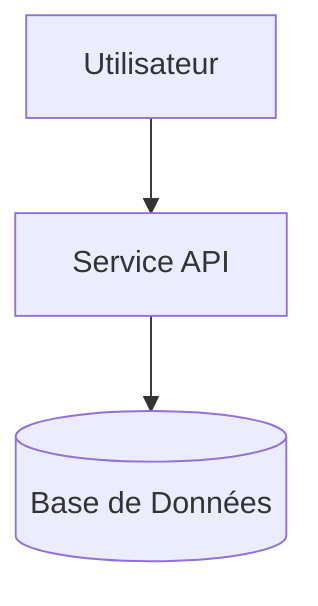

# 🚀 [Nom du Projet]

**Statut** : 🟢 En Production / 🟡 En Développement / 🔴 En Pause  
**Dépôt GitHub** : [lien-vers-repo-github](https://github.com/votre-username/repo)  
**Démo Live** : [lien-vers-demo-live](https://demo.votre-site.com)  

---

## 1. Contexte & Objectifs

- **Problème à résoudre** : [Expliquer le besoin métier ou technique]
- **Objectifs clés** : [Lister les 3 à 5 objectifs chiffrés ou qualitatifs]

---

## 2. Architecture & Choix Techniques

| Composant | Technologie | Raison du choix |
|---|---|---|
| Backend | FastAPI | Performance async, validation Pydantic |
| DB | PostgreSQL | Robustesse relationnelle |
| Infra | Docker & Kubernetes | Isolation et orchestration |

---

## 3. Cycle de Vie du Projet (10 Étapes SDLC)

1. **Plan** : Backlog défini sur GitHub Projects.
2. **Code** : Architecture propre, conventions Git Commit conventionnels.
3. **Build** : Multi-stage Dockerfile.
4. **Test** : Pytest (Couverture >= 70%).
5. **Sécurité** : Scans Trivy et Gitleaks en CI.
6. **Release** : Publication d'images SemVer sur GHCR.
7. **Infra** : Terraform & Helm charts.
8. **Deploy** : Déploiement sur cluster Kind / Cloud gratuit.
9. **Monitor** : Métriques Prometheus & Dashboards Grafana.
10. **Operate** : Postmortem d'incident réalisé.

---

## 4. Difficultés Rencontrées & Solutions

> [!WARNING]
> **Problème** : [Description du problème rencontré]  
> **Solution** : [Comment le problème a été corrigé]  

---

## 5. Ce que je ferais différemment (Rétrospective)

- [Point 1 d'amélioration]
- [Point 2 d'amélioration]
