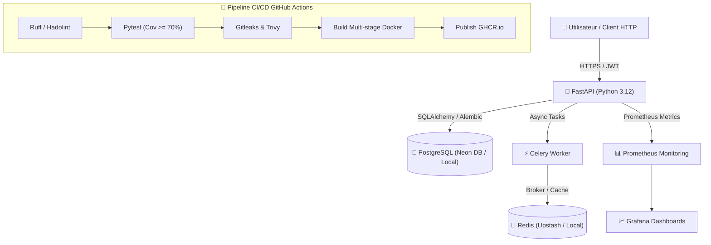

# 🚀 Engineering Logbook — DevOps & Backend

Bienvenue sur mon **carnet de bord d'ingénierie public**. Ce site documente mon apprentissage, la conception de mes projets, mes arbitrages d'architecture et la résolution d'incidents techniques sur le stack Backend & DevOps.

---

## 👨‍💻 À propos de moi

- **Profil** : Ingénieur Backend & DevOps
- **Objectif** : Concevoir des applications résilientes, automatisées, testées et supervisées en respectant les standards de production.
- **Liens** : 
  - 🐙 [GitHub](https://github.com/votre-username)
  - 💼 [LinkedIn](https://linkedin.com/in/votre-profil)
  - 📄 [Mon CV (PDF)](#)

---

## 🎯 Démarche & Méthodologie

Ce carnet s'appuie sur des **preuves concrètes** plutôt que des déclarations d'intention :
- **Transparence totale** : Chaque note de journal décrit ce qui a fonctionné, mais aussi ce qui s'est cassé et ce que j'ai appris.
- **Couverture SDLC (10 Étapes)** : Du cadrage (Plan) au maintien en condition opérationnelle (Operate & Chaos Engineering).
- **Contrainte Budget 0 €** : Utilisation exclusive d'outils Open Source et d'hébergements cloud gratuits (GitHub Pages, Oracle Cloud Free Tier, Neon DB, Render, Upstash).

---

## 📐 Architecture Globale du Projet Fil Rouge (C4 Model - Level 2)

---

## 📚 Sommaire du Carnet

| Section | Description |
|---|---|
| 🗺️ **[Plan & Roadmap](00-plan/roadmap.md)** | Feuille de route 90 jours articulée autour du SDLC 10 étapes. |
| 📓 **[Journal](01-journal/2026-w01.md)** | Carnet de bord hebdomadaire (Fait, Cassé, Appris). Éditable via CMS Web. |
| 🐍 **[Backend](02-backend/index.md)** | Architecture propre, FastAPI, SQLAlchemy, Alembic, tests Pytest & logs JSON structurés. |
| 🐳 **[DevOps & Infra](03-devops/index.md)** | Conteneurisation, CI/CD, Terraform, Helm/Kustomize, Kind K8s, Prometheus & Grafana. |
| 🚀 **[Projets](04-projets/api-gestion-taches.md)** | Projet fil rouge "API de Gestion de Tâches" avec documentation des 10 étapes. |
| 🚨 **[Incidents & Postmortems](05-incidents/postmortem-001.md)** | Retours d'expériences suite à des pannes réelles ou simulées (Chaos Engineering). |
| 💡 **[Décisions (ADR)](06-decisions/adr-001-fastapi-vs-flask-django.md)** | Architecture Decision Records expliquant "pourquoi techno X plutôt que Y". |
| ⚡ **[Cheatsheets](07-cheatsheets/index.md)** | Fiches mémos rapides sur Git, Docker, K8s, Linux, SQL et Redis. |
